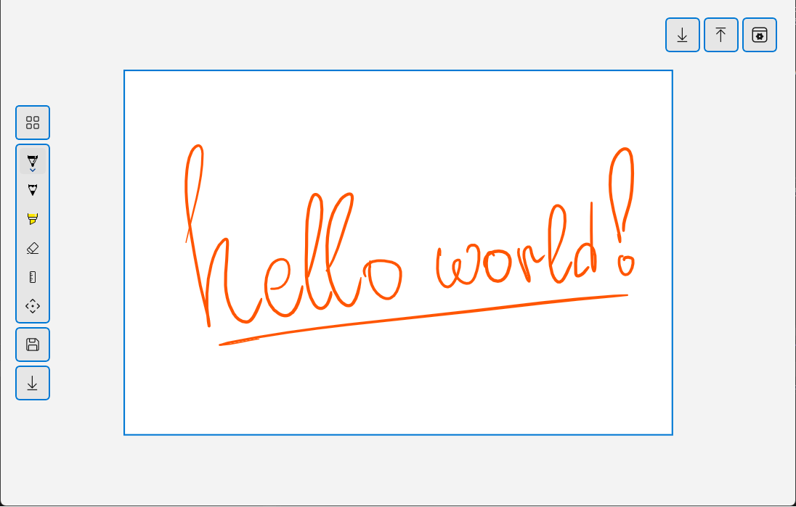
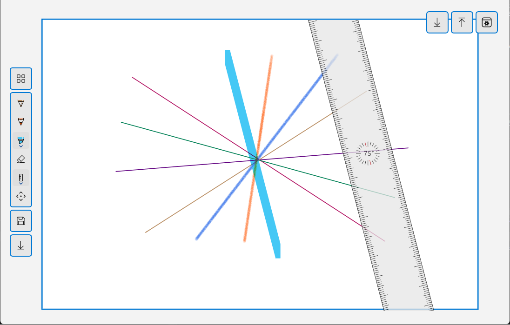
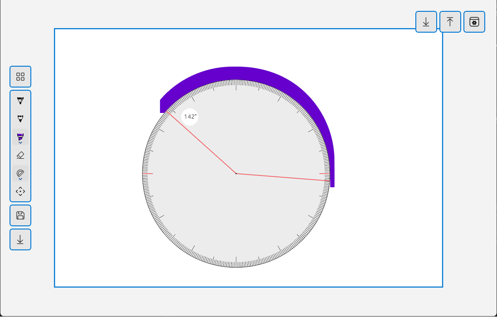
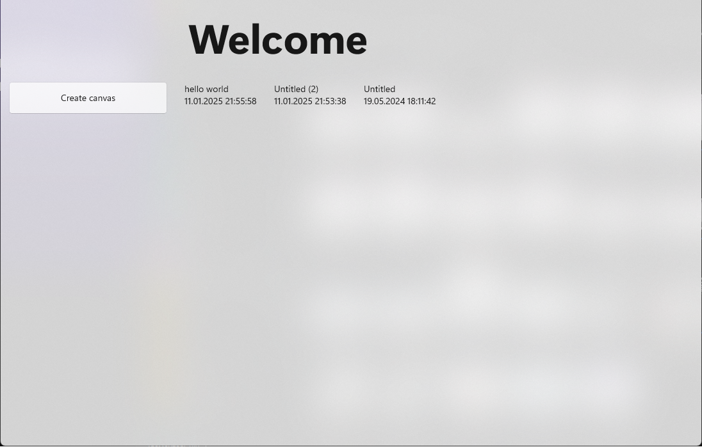

# Paint

A simple Paint application clone developed in C# using the Universal Windows Platform (UWP) framework. This project implement the basic functionality of the classic Paint application, allowing users to create, edit, and save drawings.

---
## Features

- **Drawing Tools:**
  - Pencil
  - Brush
  - Eraser
  - Ruler, Protractor

- **Color Options:**
  - Color picker to choose colors

- **Canvas Options:**
  - Resize canvas
  - Clear canvas

- **File Operations:**
  - Save drawings as image files .gif
  - Open existing image files for editing from hub

- **Zoom In/Out**

---
## Installation

1. Clone the repository:
   ```bash
   git clone https://github.com/Roilin-Lab/Paint.git
   ```

2. Open the project in Visual Studio.

3. Build and run the project.

---
## Screenshots





